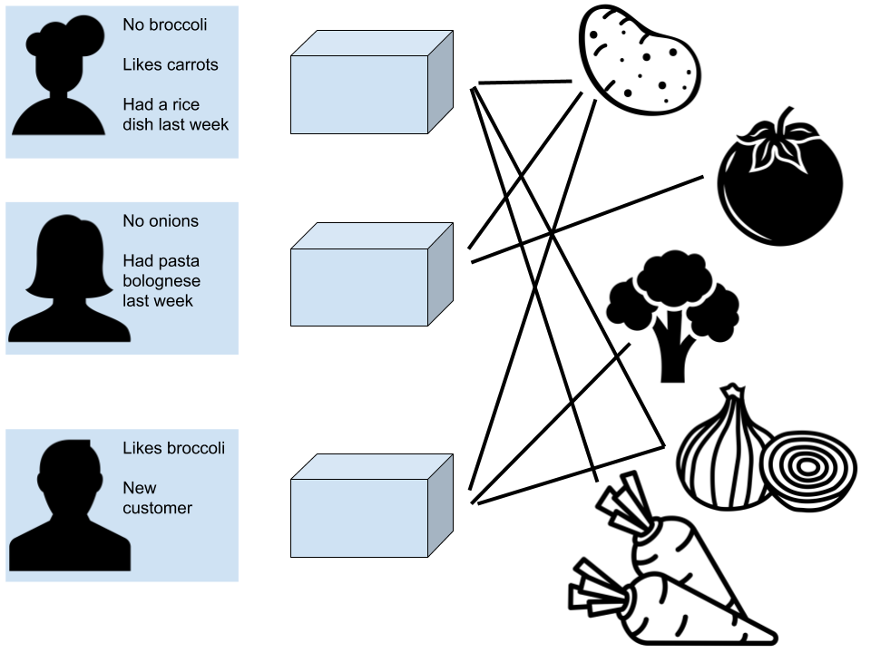

# Example: Harvest Box Optimizer

You are a data scientist at a company delivering boxes of vegetables to customers. Write an algorithm that takes into account your inventory, orders, and if known, the customer’s preferences, and create boxes out of the food you have.

## Detailed problem statement and guiding questions

In order to guide you in formulating an optimization problem for this case study, you can try to answer the questions in [this notebook](HarvestBoxOptimizerQuestions.ipynb)

## Data

You have the following data to work with

**Orders**:
- `client name`
- `date`

**Order history**:
- `date`
- `box contents`

**Client preferences**:
- `likes`
- `dislikes`

**Inventory**:
- `type`
- `weight`
- `volume`
- `best by date`

**Recipes**
- `ingredients list`

